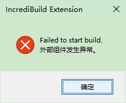

## 目录
- [目录](#目录)
- [说明](#说明)
- [运行环境](#运行环境)
- [问题记录](#问题记录)
  - [1.联合编译的CPU数量较少](#1联合编译的cpu数量较少)
    - [操作](#操作)
    - [缺陷](#缺陷)
  - [2.自己的电脑参与联合编译的CPU过多](#2自己的电脑参与联合编译的cpu过多)
    - [（1）减少本地参与联编的CPU](#1减少本地参与联编的cpu)
    - [（2）减少参与其它机子联编的CPU](#2减少参与其它机子联编的cpu)
  - [3.自动更新被取消](#3自动更新被取消)
  - [4.最终生成exe的过程链接越来越慢](#4最终生成exe的过程链接越来越慢)
  - [5.无限链接](#5无限链接)
  - [6.断网后导致IncrediBuild仅自己的机子参与](#6断网后导致incredibuild仅自己的机子参与)
  - [7.仅有自己的机子进行编译](#7仅有自己的机子进行编译)
  - [8.无法启动联编](#8无法启动联编)
    - [情形](#情形)
    - [解决](#解决)
  - [9.VS的F5开始调试后，再次显示大量项目需要编译](#9vs的f5开始调试后再次显示大量项目需要编译)
    - [情形](#情形-1)
    - [解决](#解决-1)
  - [10.链接阶段无法停止](#10链接阶段无法停止)
    - [无法解决的几个操作：](#无法解决的几个操作)
      - [~~重新打开Visual Studio~~](#重新打开visual-studio)
      - [~~Restart IncrediBuild Agent Service~~](#restart-incredibuild-agent-service)
  - [11.Failed to start build](#11failed-to-start-build)

## 说明
本文收集一些在少数情况下，客户端遇到的一些问题的解决方法。（持续更新）

## 运行环境
- Windows 10 Professional、IncrediBuild 9.6.6、Visual Studio 2019 Community
- 特大C++项目

## 问题记录

### 1.联合编译的CPU数量较少

#### 操作
在``右键任务栏图标IncrediBuild Agent``->``Agent Settings``->``Visual Studio Builds``->``Advanced``中，关闭``Limit concurrent PDB file instances to XX``。
同时，在``Agent Settings``->``Initiator``->``General``->``CPU Allocation``中，勾选``Limit maximum number of cores utilized in build to``，并将下方的``Logical core(s)``设成较大值。

> 本人的工作环境，有近100台搭配i9的的机子配置的IncrediBuild，每台机子提供6~10个cores的情况下，设置的值可高到600~900。表现为，在较多机子空闲的情况下，参与编译的CPU接近400。

据此操作完后，在参与联编的电脑足够多的情况下，可大幅度提升联合编译的CPU的数量，进而提升编译速度。

> 提示：
> 在``右键任务栏图标IncrediBuild Agent``->``Coordinator Monitor``中，可查看当前在线的机子数量，以及各个机子提供的CPU cores。

#### 缺陷
如果联合编译的项目是exe应用程序项目时，唯一的问题是，最终链接阶段，会使电脑异常卡顿，无法动弹。
推荐是在Rebuild或第一次编译的情况下开启，而在文件修改数量较少、没有新增文件、没有新增导入头文件的情况下，关闭。
``关闭时``，可据实际情况来设置concurrent的数量。

### 2.自己的电脑参与联合编译的CPU过多

#### （1）减少本地参与联编的CPU
在``Agent Settings``->``Agent``->``CPU Utilization``->``CPU Utilization - when acting as Initiator``中，将~~Single CPU, 10 Core Hyperthreading Enabled~~更改为``User Defined``，并将下方的``Utilize 20 logical core(s)``中间的值改低

#### （2）减少参与其它机子联编的CPU
在``Agent Settings``->``Agent``->``CPU Utilization``->``CPU Utilization - when acting as Helper``中，勾选``When acting as Helper utilize up to XX cores``，并设置一个合适的值

### 3.自动更新被取消
工作中遇到IncrediBuild的自动更新的弹窗，而自己恰好鼠标在Cancel按钮的位置，点击了左键取消。
可在``右键任务栏图标IncrediBuild Agent``中，看到顶部隐藏的``Update Version``，点击即可自动更新。

### 4.最终生成exe的过程链接越来越慢
定期clean清理缓存解决

### 5.无限链接
偶尔有遇到种情况，最终链接的exe经过了一个午饭、午休或下午饭，链接了半个小时、2个小时，还没有链接完。
需要重启或注销来解决。

### 6.断网后导致IncrediBuild仅自己的机子参与
重装IncrediBuild

### 7.仅有自己的机子进行编译
这种情况需要联系管理员，重新``License``

### 8.无法启动联编

#### 情形
启动IB的Build遇到如下弹框，导致无法编译 
> Maximum number of concurrent builds reached

#### 解决
重启电脑解决，来重置Incredibuild的某个任务已在编译中的错误状态。

### 9.VS的F5开始调试后，再次显示大量项目需要编译

#### 情形
在上一次手动中断IB联编后，再次启动一次IB的Build。最后在VS用F5启动开始调试前，显示大量项目需要再次编译。
此时再次启动多少次IB的Build，F5后还是会显示大量项目需要再次编译。

#### 解决
这时需要IB的Rebuild来重置项目状态。

### 10.链接阶段无法停止

打开任务管理器删除进程IncrediBuild Build Helper

#### 无法解决的几个操作：

##### ~~重新打开Visual Studio~~
该操作不会终止编译，再次编译会遇到以下问题：
> Cannot create file: F:\sndbx\miniGame\Projects\vs2019-win32-Editor-develop\PredictedInputCache_MiniStudio_Debug_Win32.dat: 另一个程序正在使用此文件，进程无法访问。 (32)
删除该文件时，会得知被IncrediBuild Build System占用而无法删除

##### ~~Restart IncrediBuild Agent Service~~
该操作也不会中断编译

### 11.Failed to start build

此时启动IncrediBuild，VS面临超过10min的无响应。
重启电脑以解决。    
