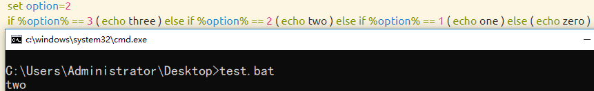
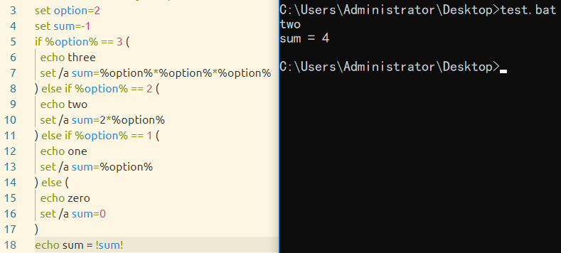

> ##### 运行环境：
> Windows 10 专业版


# if_else语句多选复合语句问题

## 目录
- [1.单条语句的嵌套](#1.单条语句的嵌套)  
- [2.多条逻辑语句的多选复合语句](#2.多条逻辑语句的多选复合语句)  

## 1.单条语句的嵌套
### 1.a

如这样一段简单的复合选择语句，是无法通过运行的。


### 1.b
当我们为每条语句加上 **()** 小括号时，它依然是无法正常运行。


### 1.c
这是因为 if 和 else 条件后的执行语句，只能做一条语句看待。
```bat
if %option% == 3 ( echo three ) else if %option% == 2 ( echo two ) else if %option% == 1 ( echo one ) else ( echo zero )
```



### 1.d
> 实际编程中，如果我们的需求较大，选项多、语句代码长时，所有if_else嵌套语句写在了一行，即影响了可读性，也提高了维护难度。我们不大可能编写这样一行代码。

由于产生了换行，我们需要在每条条件执行语句结尾的 **）**后面加上 **^**，以充当续行的作用。
```bat
set option=2
if %option% == 3 ( echo three ) ^
else if %option% == 2 ( echo two ) ^
else if %option% == 1 ( echo one ) ^
else ( echo zero )
```


## 2.多条逻辑语句的多选复合语句
### 2.a
上述通过添加 **^** 的形式，确实解决了多层嵌套的问题。但是对于多条语句的执行情况，又是不同。
我们可以看到，进入第二行的条件里，它把后面的赋值语句，当字符串输出了。如果是更复杂的语法，而不是例子中第一条语句是echo，就会看到语法错误。


这时，我们需要把两条语句分行编写，才能保证程序的正确运行。
到了这里，可能会有熟悉C/C++编程习惯的朋友，会编写这样if_else格式的语句：
```C
if (option == 2) 
{
  //
}
else if (option == 1)
{
  //
}
else 
{
  //
}
```
又或者是Java的编程习惯的形式：
```Java
if (option == 2) {
  //
} else if (option == 1) {
  //
} else {
  //
}
```
### 2.b
我们先看下C/C++编写习惯的if_else语句：
程序运行到第一个条件语句就已经报错。这就是因为 if 条件后的操作都视为一条语句。

### 2.c
我们在每个if后面加上续行操作符 **^** 后，我们并不能得到想要的运行结果。
我的一个理解是，续行操作符只将下一行语句前置到同行，由于读到下一行没有语句，就依照程序逻辑往下运行。这时就出现了我们一般在C/C++、Java等语言没出现过的一种情况。**嵌套在if_else语句中间的语句被执行了。**观察结果，我们可以看到每条echo语句都有执行，并且执行的4次sum赋值，显示的就是最后一次赋值为0的执行结果。**这是bat脚本的第一个很神奇的语法特点。**
这个续行操作符跳过空的一行语句，继续执行了正确的语句，找到了else时，判断到前面有if语句，并不认为是语法错误，就继续往下执行。

### 2.d
这样添加续行操作符的动作，没有识别到条件语句后的逻辑是一个代码块。我们尝试直接将每个条件语句后的语句块的左括号 **(** 前置到与if语句同一行的后面，我们却得到了正确的结果：
```bat
setlocal EnableDelayedExpansion
set option=2
set sum=-1
if %option% == 3 ( 
  echo three 
  set /a sum=%option%*%option%*%option%
) ^
else if %option% == 2 ( 
  echo two 
  set /a sum=2*%option%
) ^
else if %option% == 1 ( 
  echo one 
  set /a sum=%option% 
) ^
else ( 
  echo zero 
  set /a sum=0 
)
echo sum = !sum!
```


至此，我们确实得到了正确的运行结果。不过我们还是想要验证，类似C/C++编程习惯格式的语句。回退到2.c的操作上，继续做修改。
我们先排除几种修改的可能：
> * 右括号后面的续行操作符 **^** 不会删除。这是第1大点得出的结论。
> * 不会在每一行代码后加续行操作符 **^** ，这与2.a的错误结论相等。

### 2.e
在每一行代码后加续行操作符。
结论不理想，这样的操作更像是一个多行输出的操作。


### 2.f
在上面的基础上，在每个左括号 **(** 后面加续行操作符。
结论更不理想，没有一条语句有执行到。


### 2.g
在2.c的基础上，只做在每个左括号 **(** 后面加续行操作符的动作。
结论依然是错误的。


#正确的写法

> 至此，我们没有得到类似C/C++编写习惯的if_else格式的正确写法，但是有2.d这样的结论：
- **if** 语句与左括号 **(** 同行
- 右括号 **)**  不与 **else if** 同行
- 右括号 **)** 后面加上续行操作符 **^**
```bat
setlocal EnableDelayedExpansion
set option=2
set sum=-1
if %option% == 3 ( 
  echo three 
  set /a sum=%option%*%option%*%option%
) ^
else if %option% == 2 ( 
  echo two 
  set /a sum=2*%option%
) ^
else if %option% == 1 ( 
  echo one 
  set /a sum=%option% 
) ^
else ( 
  echo zero 
  set /a sum=0 
)
echo sum = !sum!
```
### 2.h.Java编写习惯的写法
我们也很清楚地看到，这种编写习惯也是正确的。
```bat
setlocal EnableDelayedExpansion
set option=2
set sum=-1
if %option% == 3 ( 
  echo three 
  set /a sum=%option%*%option%*%option% 
) else if %option% == 2 ( 
  echo two 
  set /a sum=2*%option% 
) else if %option% == 1 ( 
  echo one 
  set /a sum=%option% 
) else ( 
  echo zero 
  set /a sum=0 
)
echo sum = !sum!
```
